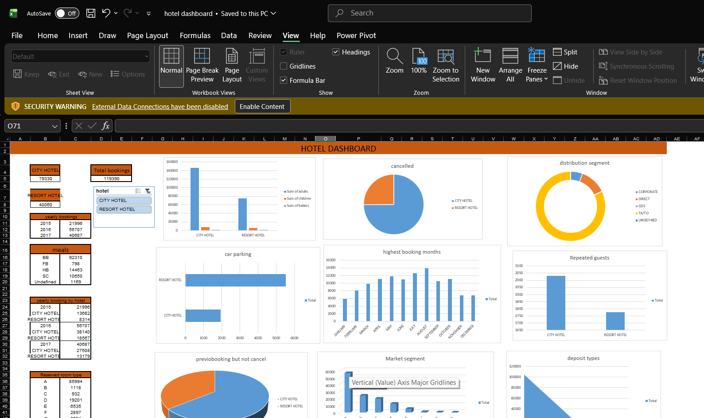

# hotel-analysis-dashboard
Excel dashboard analyzing hotel booking data
# 🏨 Hotel Data Analysis Dashboard

## 📌 Project Overview
This project focuses on analyzing hotel booking data to extract meaningful insights.  
Using Excel, I created pivot tables and interactive dashboards to understand trends, customer behavior, and booking patterns.

---

## 🎯 Objectives
- Analyze hotel booking data  
- Identify trends and patterns  
- Create interactive dashboards  
- Generate actionable insights  

---

## 🛠️ Tools Used
- Microsoft Excel  
- Pivot Tables  
- Charts & Dashboards  

---

## 📊 Key Insights
- City hotels have higher bookings compared to resort hotels  
- Seasonal trends affect booking rates  
- Customer preferences vary based on hotel type  
- Cancellation rates differ across segments  

---

## 📈 Dashboard Preview

---

## 🔄 Project Updates
- Cleaned and organized raw data  
- Created pivot tables for analysis  
- Built interactive dashboard for visualization  

---

## 🚀 How to Use
1. Download the Excel file  
2. Open in Microsoft Excel  
3. Explore pivot tables and dashboard  

---

## 👤 Author
yeswanth pavan
Aspiring Data Analyst 📊  
